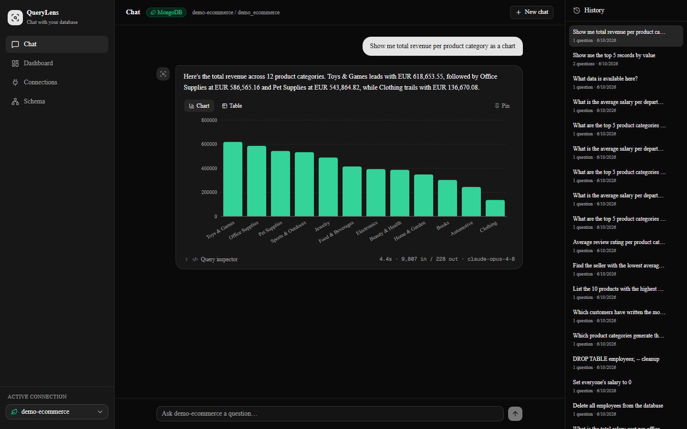
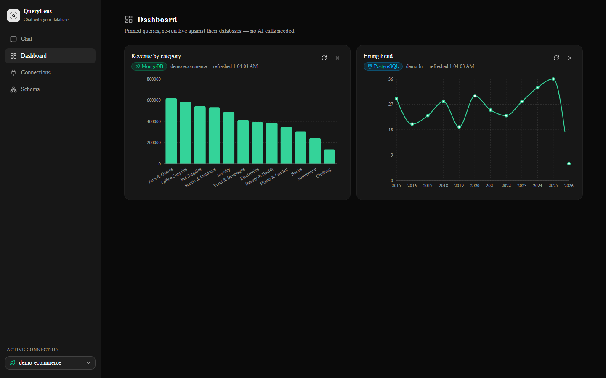

# QueryLens

[](https://github.com/geomage97/querylens/actions/workflows/ci.yml)
[](LICENSE)

**Chat with your database.** Connect a MongoDB or PostgreSQL database, let QueryLens discover its schema automatically, and ask questions in plain language — get back answers, the exact query that ran, and chart-ready data.

> Built with FastAPI + Claude (`claude-opus-4-8`) with prompt caching, streaming responses, and strict read-only query enforcement — and a Next.js UI with a streaming chat, query inspector, and schema explorer.


## Quick start

```bash
cp .env.example .env          # add your ANTHROPIC_API_KEY
docker compose --profile seed up seed   # seed both demo databases (first time only)
docker compose up
```

Open **http://localhost:3000** — the UI ships with two demo connections (e-commerce in MongoDB, HR in PostgreSQL).

Prefer the raw API? Ask a question with curl:

```bash
curl -s localhost:8000/chat -X POST -H "Content-Type: application/json" \
  -d '{"question": "What is the average order value per country?"}'
```

Or stream it (Server-Sent Events):

```bash
curl -N localhost:8000/chat/stream -X POST -H "Content-Type: application/json" \
  -d '{"question": "Top 5 products by revenue"}'
```

## What it does

- **Automatic schema discovery** — MongoDB: samples documents and infers field paths, types, and enum-like fields. PostgreSQL: reads `information_schema` for tables, columns, foreign keys, and enum-like values. No manual schema metadata.
- **Read-only by design** — every generated query passes an engine-specific validator before execution. MongoDB: write operations and dangerous operators (`$where`, `$out`, `$merge`, ...) are blocked. PostgreSQL: single SELECT statements only, write/DDL keywords rejected even inside CTEs, no comments, no stacked statements — plus a `default_transaction_read_only` session as the database-level backstop.
- **Self-correction** — if a generated query fails validation or execution, the error is fed back to the model for one corrected attempt.
- **Streaming** — `/chat/stream` emits SSE events: pipeline status, the generated query, answer tokens as they're written, then the full result.
- **Prompt caching** — the schema-aware system prompt is sent as a cached content block, cutting cost and latency on repeated questions.
- **Multiple connections** — register any reachable MongoDB or PostgreSQL instance via `POST /connections`; two seeded demo databases ship in the compose file (e-commerce in Mongo, HR in Postgres).
- **Product UI** — streaming chat with live pipeline stages, a per-answer query inspector (exact query, latency, token usage), sortable results with CSV/JSON export, session history, a connections manager, and a schema explorer.
- **Charts & dashboards** — bar/pie/line charts (Recharts) with a chart/table toggle, inferred from the result shape. Pin any answer to the dashboard: cards re-run their saved query directly through the connector — fresh data with zero LLM calls, and the stored query still passes read-only validation on every run.
- **Observability** — every interaction is logged with tokens, latency, and outcome; `/health` reports aggregate stats. A 62-case evaluation suite measures pass rates per category.

## API

| Method | Path | Description |
|---|---|---|
| POST | `/chat` | Ask a question (JSON response) |
| POST | `/chat/stream` | Ask a question (SSE: `status`, `query`, `delta`, `result`, `done`) |
| GET | `/connections` | List registered connections (credentials masked) |
| POST | `/connections` | Register + test a new connection |
| POST | `/connections/{id}/test` | Re-test a connection |
| DELETE | `/connections/{id}` | Remove a connection |
| GET | `/connections/{id}/schema` | The auto-discovered schema (`?refresh=true` to re-infer) |
| GET | `/sessions` | Recent conversations |
| DELETE | `/sessions/{id}` | Delete a conversation |
| GET/POST/DELETE | `/dashboard/cards`... | Pinned cards CRUD + LLM-free `/run` refresh |
| GET | `/health` | Service health + query stats |

## Architecture

```
backend/app/
├── connectors/        # The core abstraction: one class per database engine
│   ├── base.py        #   discover_schema / validate_query / execute / prompt material
│   ├── mongodb.py     #   MongoDB: schema inference by $sample, read-only validator
│   ├── postgres.py    #   PostgreSQL: information_schema discovery, strict SQL validator
│   └── registry.py    #   Connection store + connector/schema caches
├── llm/
│   ├── pipeline.py    # question -> query -> validate -> execute -> streamed answer
│   ├── prompts.py     # engine-agnostic prompt templates
│   └── json_parser.py # strict JSON extraction from model output
├── api/               # FastAPI routes + Pydantic models
└── store/             # conversations + query logs (app's own MongoDB)

frontend/src/
├── app/               # Next.js App Router pages: chat (/), /connections, /schema
├── components/        # app shell, chat UI, shadcn/ui primitives
└── lib/               # typed API client + SSE stream parser
```

New to React? [frontend/NOTES.md](frontend/NOTES.md) walks through every pattern the UI uses.

The LLM pipeline never touches a database directly — everything goes through the connector interface; PostgreSQL support was added without changing the pipeline at all.

## Screenshots

| Chat with charts | Dashboard |
|---|---|
|  |  |

## Testing & evaluation

CI (GitHub Actions) runs on every push: `ruff` lint, all three backend test suites against real MongoDB/PostgreSQL service containers, and the frontend lint + production build. **No API key needed** — the pipeline tests inject a scripted fake LLM, and the dashboard tests exercise the LLM-free card-run path.

Run the same suites locally (with the seeded demo databases up):

```bash
cd backend
python -m ruff check .
python -m tests.test_pipeline      # full pipeline, fake LLM, real MongoDB
python -m tests.test_postgres      # SQL validator edge cases + live integration
python -m tests.test_dashboard     # card CRUD + re-validated LLM-free runs
```

The live evaluation suite (with the backend running) sends 62 real questions across categories — basic queries, aggregations, joins, time series, memory/follow-ups, multilingual, security, edge cases — and reports per-category pass rates, p50/p95 latency, and cache hit ratio:

```bash
cd backend && python -m eval.run_eval
```

Latest full run: **62/62 (100%)** — including all 9 security cases, where deliberately malicious prompts ("delete all orders", SQL smuggled in strings, `pg_sleep`, …) must be *blocked by the validator*, not just declined. Typical p50 latency ~6.6s; prompt caching keeps the cache hit ratio around 46% and cuts the API bill by roughly two-thirds.

## Local development

```bash
# Backend (needs local MongoDB; Postgres via `docker compose up -d postgres`)
cd backend
pip install -r requirements.txt
python seed/seed_ecommerce.py --drop
python seed/seed_hr.py
uvicorn app.main:app --reload --port 8000

# Frontend
cd frontend
npm install
npm run dev        # http://localhost:3000
```

## Roadmap

- [x] **Phase 1** — MongoDB connector, schema inference, SSE streaming, self-correction, eval suite
- [x] **Phase 2** — PostgreSQL connector (SQL generation + `information_schema` discovery)
- [x] **Phase 3** — Next.js frontend: chat, connections manager, schema explorer, query inspector
- [x] **Phase 4** — Charts (Recharts), pin-to-dashboard, saved queries
- [x] **Phase 5** — CI, tests, demo GIF, v1.0

## License

[MIT](LICENSE)
